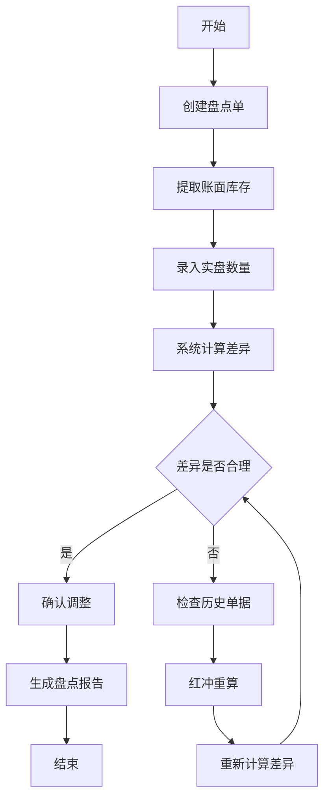

## 1. 产品概述

线下零售门店数据统计分析平台，整合采购入库、前台销售、库存盘点、退货换货全链路数据，实现数据聚合、核算、报表一体化服务。为零售企业提供实时库存监控、多维度销售分析、智能预警提醒、自定义报表等核心功能，帮助企业提升运营效率、降低库存风险、优化经营决策。

## 2. 核心功能

### 2.1 用户角色

| 角色 | 注册方式 | 核心权限 |
|------|----------|----------|
| 系统管理员 | 后台创建 | 全功能权限、用户管理、系统配置 |
| 门店经理 | 后台创建 | 查看全店数据、报表导出、预警处理 |
| 收银员 | 后台创建 | 销售操作、个人业绩查询 |
| 库存管理员 | 后台创建 | 库存操作、盘点处理、采购入库 |

### 2.2 功能模块

1. **数据仪表盘**：经营概览、核心指标卡、实时数据趋势
2. **销售分析**：时段/品类/店员/客户多维度分析、图表可视化
3. **库存管理**：实时库存、出入库流水、库存预警、临期滞销标记
4. **采购管理**：采购入库、供应商管理、采购退货
5. **盘点管理**：盘点任务、差异核对、库存调整
6. **报表中心**：自定义报表模板、指标维度组合、批量导出
7. **系统管理**：门店配置、用户管理、数据字典

### 2.3 页面详情

| 页面名称 | 模块名称 | 功能描述 |
|----------|----------|----------|
| 数据仪表盘 | 核心指标区 | 销售额、毛利、客单价、复购率等关键指标实时展示 |
| 数据仪表盘 | 趋势图表区 | 销售趋势、库存趋势、客流趋势多图表联动展示 |
| 数据仪表盘 | 预警提醒区 | 临期商品、滞销商品、库存不足预警列表 |
| 销售分析 | 多维筛选区 | 时间段、品类、店员、客户多维度联动筛选 |
| 销售分析 | 指标计算区 | 销售额、毛利、毛利率、客单价、复购率实时计算 |
| 销售分析 | 图表展示区 | 柱状图、折线图、饼图、热力图数据可视化 |
| 库存管理 | 实时库存区 | SKU级库存查询、库存状态标记 |
| 库存管理 | 出入库流水 | 入库、出库、调拨、盘点全链路流水记录 |
| 库存管理 | 智能预警区 | 临期/滞销/缺货自动标记、预警阈值配置 |
| 采购管理 | 采购入库 | 采购单创建、入库确认、成本核算 |
| 采购管理 | 退货管理 | 采购退货、供应商退货处理 |
| 盘点管理 | 盘点任务 | 创建盘点单、录入实盘数、差异计算 |
| 盘点管理 | 差异处理 | 差异核对、红冲重算、库存调整 |
| 报表中心 | 模板管理 | 自定义报表模板、指标维度自由组合 |
| 报表中心 | 报表生成 | 一键生成报表、批量导出Excel/PDF |
| 系统管理 | 门店配置 | 门店信息、预警阈值、数据隔离配置 |
| 系统管理 | 用户管理 | 用户创建、角色分配、权限控制 |

## 3. 核心流程

### 3.1 库存核算流程

商品采购入库 → 系统自动计算库存成本 → 前台销售扣减库存 → 实时计算当前库存 → 触发库存预警检查 → 临期/滞销商品自动标记 → 生成出入库流水记录

### 3.2 销售分析流程

选择分析维度（时段/品类/店员/客户） → 选择时间范围 → 系统聚合销售数据 → 计算核心指标（销售额/毛利/客单价/复购率） → 生成多类型图表 → 支持指标下钻查看明细 → 支持联动筛选和时间段切换

### 3.3 盘点差异处理流程

创建盘点任务 → 录入账面库存 → 录入实盘数量 → 系统计算差异 → 人工核对差异原因 → 红冲历史单据重算（如需） → 确认调整库存 → 生成盘点报告

### 3.4 自定义报表流程

选择报表模板 → 配置指标（销售额/毛利/库存等） → 配置维度（时间/品类/门店等） → 设置筛选条件 → 预览报表数据 → 保存模板 → 一键生成报表 → 批量导出文件

## 4. 用户界面设计

### 4.1 设计风格

- **主色调**：专业深蓝 `#1E3A5F`，代表数据的严谨和专业
- **辅助色**：活力橙 `#FF7A45`（预警）、成功绿 `#22C55E`（正常）、警示红 `#EF4444`（异常）
- **中性色**：深灰 `#1F2937`、中灰 `#6B7280`、浅灰 `#F3F4F6`、纯白 `#FFFFFF`
- **按钮风格**：圆角6px、悬停微上浮效果、点击反馈动画
- **字体**：主字体 `PingFang SC`、数字字体 `Roboto Mono`、标题字重600、正文字重400
- **布局风格**：左侧导航+右侧内容区、卡片式模块布局、清晰的层级分隔
- **图标风格**：线性图标、统一24px尺寸、颜色跟随语义

### 4.2 页面设计概述

| 页面名称 | 模块名称 | UI元素 |
|----------|----------|--------|
| 数据仪表盘 | 核心指标卡 | 渐变背景卡片、指标数值动态增长动画、环比箭头指示 |
| 数据仪表盘 | 趋势图表 | ECharts折线图/柱状图、图例切换、数据点hover提示 |
| 数据仪表盘 | 预警列表 | 三色状态标签、倒计时天数、快速处理按钮 |
| 销售分析 | 筛选区 | 级联选择器、日期范围选择、下拉多选、重置按钮 |
| 销售分析 | 图表区 | 网格布局图表、支持拖拽调整、一键全屏查看 |
| 库存管理 | 库存表格 | 固定表头、斑马纹、状态色标记、行展开查看流水 |
| 库存管理 | 流水时间线 | 垂直时间线、操作节点图标、出入库方向箭头 |
| 报表中心 | 配置区 | 拖拽式指标选择、维度复选框组、实时预览区 |
| 报表中心 | 导出区 | 文件格式选择、批量选择、导出进度条 |

### 4.3 响应式设计

- **设计原则**：Desktop-first，大屏优先，兼顾平板展示
- **断点设计**：1920px（最优）、1440px（标准）、1024px（兼容）
- **适配策略**：侧边栏可折叠、图表自适应容器宽度、表格横向滚动
- **触摸优化**：按钮最小44x44px、下拉菜单展开区域放大、滑动切换日期段

### 4.4 交互动效

- **页面加载**：骨架屏占位、内容淡入动画、指标数字滚动效果
- **数据切换**：图表平滑过渡动画、筛选条件联动刷新
- **预警提醒**：数字红点呼吸动画、异常项高亮闪烁
- **悬停效果**：卡片微上浮+阴影加深、按钮背景色渐变
- **操作反馈**：提交后按钮loading态、成功/失败toast提示
