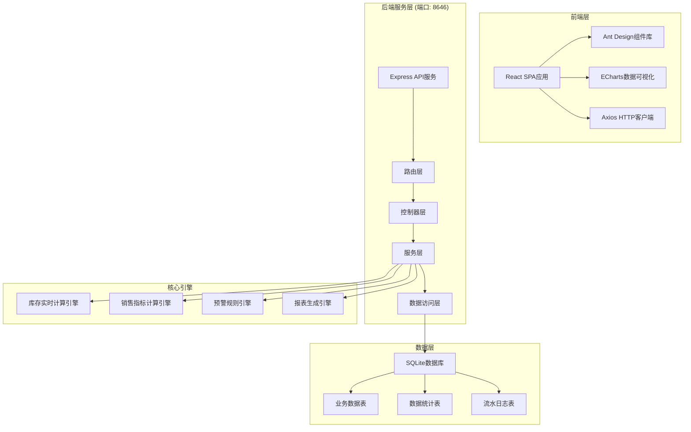
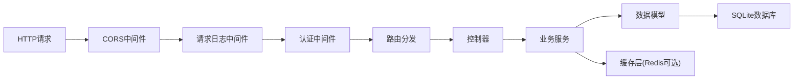
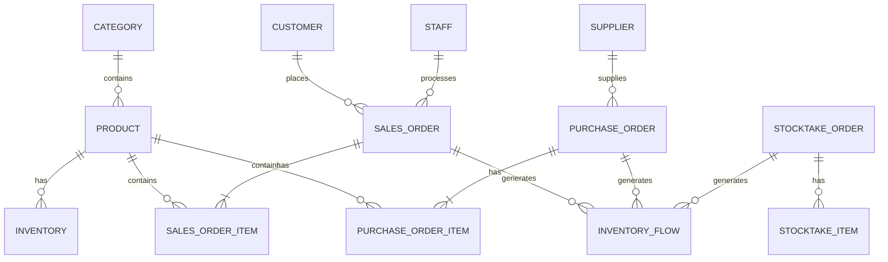

## 1. 架构设计



## 2. 技术描述

- **前端**：React 18 + Ant Design 5 + ECharts 5 + Axios + Day.js
- **构建方式**：无需构建工具，直接使用UMD包运行，Babel Standalone处理JSX
- **后端**：Express 4.x + Node.js 18+，运行端口8646
- **数据库**：SQLite 3，门店数据独立存储，支持多门店数据隔离
- **数据导出**：SheetJS (xlsx) + PDFKit，支持Excel/PDF批量导出
- **性能优化**：数据库索引、查询分页、数据缓存、懒加载

## 3. 目录结构

```
lp0026/
├── server/                          # 后端服务
│   ├── app.js                       # 主入口文件
│   ├── config/                      # 配置文件
│   │   └── database.js              # 数据库配置
│   ├── routes/                      # 路由层
│   │   ├── dashboard.js             # 仪表盘接口
│   │   ├── sales.js                 # 销售分析接口
│   │   ├── inventory.js             # 库存管理接口
│   │   ├── purchase.js              # 采购管理接口
│   │   ├── stocktake.js             # 盘点管理接口
│   │   ├── report.js                # 报表中心接口
│   │   └── system.js                # 系统管理接口
│   ├── controllers/                 # 控制器层
│   ├── services/                    # 业务逻辑层
│   │   ├── inventoryService.js      # 库存计算服务
│   │   ├── salesService.js          # 销售分析服务
│   │   ├── reportService.js         # 报表生成服务
│   │   └── alertService.js          # 预警服务
│   ├── models/                      # 数据模型层
│   │   └── db.js                    # 数据库连接与初始化
│   ├── middleware/                  # 中间件
│   └── utils/                       # 工具函数
│       ├── export.js                # 导出工具
│       └── pagination.js            # 分页工具
├── client/                          # 前端应用
│   ├── index.html                   # 主页面
│   ├── css/                         # 样式文件
│   │   └── app.css                  # 全局样式
│   ├── js/                          # JavaScript文件
│   │   ├── app.jsx                  # 主应用组件
│   │   ├── components/              # 公共组件
│   │   ├── pages/                   # 页面组件
│   │   │   ├── Dashboard.jsx        # 数据仪表盘
│   │   │   ├── SalesAnalysis.jsx    # 销售分析
│   │   │   ├── Inventory.jsx        # 库存管理
│   │   │   ├── Purchase.jsx         # 采购管理
│   │   │   ├── Stocktake.jsx        # 盘点管理
│   │   │   ├── ReportCenter.jsx     # 报表中心
│   │   │   └── SystemConfig.jsx     # 系统管理
│   │   ├── services/                # API服务
│   │   └── utils/                   # 前端工具
│   └── lib/                         # 第三方库(已存在)
├── data/                            # 数据目录
│   └── retail.db                    # SQLite数据库
├── package.json                     # 项目依赖
└── .gitignore                       # Git忽略文件
```

## 4. 路由定义

| 路由路径 | 方法 | 用途 |
|----------|------|------|
| /api/dashboard/overview | GET | 获取仪表盘概览数据 |
| /api/dashboard/trends | GET | 获取趋势数据 |
| /api/dashboard/alerts | GET | 获取预警列表 |
| /api/sales/analysis | POST | 销售多维度分析查询 |
| /api/sales/metrics | POST | 销售核心指标计算 |
| /api/sales/detail | GET | 销售明细下钻 |
| /api/inventory/current | GET | 实时库存查询 |
| /api/inventory/flow | GET | 出入库流水记录 |
| /api/inventory/calculate | POST | 库存实时计算 |
| /api/inventory/alert/check | POST | 库存预警检查 |
| /api/purchase/order | POST | 创建采购单 |
| /api/purchase/warehouse | POST | 采购入库确认 |
| /api/purchase/return | POST | 采购退货 |
| /api/stocktake/create | POST | 创建盘点单 |
| /api/stocktake/diff | POST | 计算盘点差异 |
| /api/stocktake/redo | POST | 红冲重算 |
| /api/stocktake/adjust | POST | 库存调整确认 |
| /api/report/templates | GET | 获取报表模板列表 |
| /api/report/templates | POST | 保存自定义报表模板 |
| /api/report/generate | POST | 生成报表数据 |
| /api/report/export | POST | 批量导出报表 |
| /api/system/config | GET/POST | 系统配置 |
| /api/system/users | GET/POST | 用户管理 |

## 5. API 数据定义

### 5.1 通用响应结构

```typescript
interface ApiResponse<T> {
  code: number;
  message: string;
  data: T;
  timestamp: number;
}

interface PageResult<T> {
  list: T[];
  total: number;
  page: number;
  pageSize: number;
}
```

### 5.2 销售分析请求

```typescript
interface SalesAnalysisRequest {
  startDate: string;
  endDate: string;
  dimensions: ('time' | 'category' | 'staff' | 'customer')[];
  metrics: ('salesAmount' | 'profit' | 'profitRate' | 'orderCount' | 'customerPrice' | 'repurchaseRate')[];
  filters: {
    categoryIds?: number[];
    staffIds?: number[];
    customerLevels?: string[];
  };
}

interface SalesAnalysisResponse {
  dimensions: string[];
  metrics: string[];
  data: Array<{
    dimensionValue: string;
    dimensionLabel: string;
    salesAmount: number;
    profit: number;
    profitRate: number;
    orderCount: number;
    customerPrice: number;
    repurchaseRate: number;
  }>;
  summary: {
    totalSalesAmount: number;
    totalProfit: number;
    avgProfitRate: number;
    totalOrderCount: number;
    avgCustomerPrice: number;
    overallRepurchaseRate: number;
  };
}
```

### 5.3 库存数据结构

```typescript
interface InventoryItem {
  id: number;
  sku: string;
  productName: string;
  categoryId: number;
  categoryName: string;
  quantity: number;
  availableQty: number;
  lockedQty: number;
  costPrice: number;
  avgCostPrice: number;
  latestCostPrice: number;
  expireDate: string;
  daysToExpire: number;
  lastSaleDate: string;
  daysNoSale: number;
  alertStatus: 'normal' | 'low_stock' | 'expiring' | 'slow_moving' | 'overstock';
  warningThreshold: number;
  createdAt: string;
  updatedAt: string;
}

interface InventoryFlowRecord {
  id: number;
  flowNo: string;
  flowType: 'purchase_in' | 'sales_out' | 'return_in' | 'exchange_out' | 'exchange_in' | 'adjust_in' | 'adjust_out' | 'stocktake';
  referenceNo: string;
  sku: string;
  productName: string;
  quantity: number;
  beforeQty: number;
  afterQty: number;
  costPrice: number;
  operatorId: number;
  operatorName: string;
  remark: string;
  createdAt: string;
}
```

## 6. 服务器架构



## 7. 数据模型

### 7.1 ER图



### 7.2 核心数据表DDL

```sql
-- 商品表
CREATE TABLE product (
    id INTEGER PRIMARY KEY AUTOINCREMENT,
    sku VARCHAR(50) UNIQUE NOT NULL,
    barcode VARCHAR(50),
    name VARCHAR(200) NOT NULL,
    category_id INTEGER NOT NULL,
    spec VARCHAR(200),
    unit VARCHAR(20),
    cost_price DECIMAL(10,2) DEFAULT 0,
    sale_price DECIMAL(10,2) DEFAULT 0,
    warning_threshold INTEGER DEFAULT 10,
    expire_days_warning INTEGER DEFAULT 30,
    slow_moving_days INTEGER DEFAULT 90,
    status INTEGER DEFAULT 1,
    created_at DATETIME DEFAULT CURRENT_TIMESTAMP,
    updated_at DATETIME DEFAULT CURRENT_TIMESTAMP,
    INDEX idx_sku (sku),
    INDEX idx_category (category_id)
);

-- 库存表
CREATE TABLE inventory (
    id INTEGER PRIMARY KEY AUTOINCREMENT,
    product_id INTEGER UNIQUE NOT NULL,
    sku VARCHAR(50) UNIQUE NOT NULL,
    quantity INTEGER DEFAULT 0,
    available_qty INTEGER DEFAULT 0,
    locked_qty INTEGER DEFAULT 0,
    avg_cost_price DECIMAL(10,2) DEFAULT 0,
    total_cost_amount DECIMAL(12,2) DEFAULT 0,
    last_in_date DATETIME,
    last_out_date DATETIME,
    last_sale_date DATETIME,
    expire_date DATE,
    alert_status VARCHAR(20) DEFAULT 'normal',
    updated_at DATETIME DEFAULT CURRENT_TIMESTAMP,
    INDEX idx_alert_status (alert_status),
    INDEX idx_quantity (quantity)
);

-- 出入库流水表
CREATE TABLE inventory_flow (
    id INTEGER PRIMARY KEY AUTOINCREMENT,
    flow_no VARCHAR(32) UNIQUE NOT NULL,
    flow_type VARCHAR(20) NOT NULL,
    reference_no VARCHAR(32),
    product_id INTEGER NOT NULL,
    sku VARCHAR(50) NOT NULL,
    quantity INTEGER NOT NULL,
    before_qty INTEGER NOT NULL,
    after_qty INTEGER NOT NULL,
    cost_price DECIMAL(10,2) DEFAULT 0,
    operator_id INTEGER,
    operator_name VARCHAR(50),
    remark VARCHAR(500),
    is_red_offset INTEGER DEFAULT 0,
    original_flow_id INTEGER,
    created_at DATETIME DEFAULT CURRENT_TIMESTAMP,
    INDEX idx_flow_type (flow_type),
    INDEX idx_product (product_id),
    INDEX idx_created_at (created_at),
    INDEX idx_reference (reference_no)
);

-- 销售订单主表
CREATE TABLE sales_order (
    id INTEGER PRIMARY KEY AUTOINCREMENT,
    order_no VARCHAR(32) UNIQUE NOT NULL,
    customer_id INTEGER,
    staff_id INTEGER,
    total_amount DECIMAL(12,2) DEFAULT 0,
    discount_amount DECIMAL(10,2) DEFAULT 0,
    actual_amount DECIMAL(12,2) DEFAULT 0,
    total_cost DECIMAL(12,2) DEFAULT 0,
    profit DECIMAL(12,2) DEFAULT 0,
    profit_rate DECIMAL(5,2) DEFAULT 0,
    item_count INTEGER DEFAULT 0,
    pay_type VARCHAR(20),
    is_void INTEGER DEFAULT 0,
    void_reason VARCHAR(200),
    void_at DATETIME,
    created_at DATETIME DEFAULT CURRENT_TIMESTAMP,
    INDEX idx_order_date (created_at),
    INDEX idx_customer (customer_id),
    INDEX idx_staff (staff_id),
    INDEX idx_is_void (is_void)
);

-- 销售订单明细表
CREATE TABLE sales_order_item (
    id INTEGER PRIMARY KEY AUTOINCREMENT,
    order_id INTEGER NOT NULL,
    order_no VARCHAR(32) NOT NULL,
    product_id INTEGER NOT NULL,
    sku VARCHAR(50) NOT NULL,
    product_name VARCHAR(200) NOT NULL,
    quantity INTEGER NOT NULL,
    unit_price DECIMAL(10,2) NOT NULL,
    cost_price DECIMAL(10,2) DEFAULT 0,
    subtotal DECIMAL(12,2) NOT NULL,
    profit DECIMAL(12,2) DEFAULT 0,
    created_at DATETIME DEFAULT CURRENT_TIMESTAMP,
    INDEX idx_order (order_id),
    INDEX idx_product (product_id),
    INDEX idx_created_at (created_at)
);

-- 采购订单表
CREATE TABLE purchase_order (
    id INTEGER PRIMARY KEY AUTOINCREMENT,
    order_no VARCHAR(32) UNIQUE NOT NULL,
    supplier_id INTEGER,
    total_amount DECIMAL(12,2) DEFAULT 0,
    actual_amount DECIMAL(12,2) DEFAULT 0,
    status VARCHAR(20) DEFAULT 'pending',
    operator_id INTEGER,
    remark VARCHAR(500),
    in_warehouse_at DATETIME,
    created_at DATETIME DEFAULT CURRENT_TIMESTAMP,
    INDEX idx_status (status),
    INDEX idx_created_at (created_at)
);

-- 采购订单明细表
CREATE TABLE purchase_order_item (
    id INTEGER PRIMARY KEY AUTOINCREMENT,
    order_id INTEGER NOT NULL,
    product_id INTEGER NOT NULL,
    sku VARCHAR(50) NOT NULL,
    product_name VARCHAR(200) NOT NULL,
    quantity INTEGER NOT NULL,
    cost_price DECIMAL(10,2) NOT NULL,
    subtotal DECIMAL(12,2) NOT NULL,
    expire_date DATE,
    created_at DATETIME DEFAULT CURRENT_TIMESTAMP,
    INDEX idx_order (order_id),
    INDEX idx_product (product_id)
);

-- 盘点单表
CREATE TABLE stocktake_order (
    id INTEGER PRIMARY KEY AUTOINCREMENT,
    order_no VARCHAR(32) UNIQUE NOT NULL,
    stocktake_date DATE NOT NULL,
    category_id INTEGER,
    status VARCHAR(20) DEFAULT 'pending',
    total_book_qty INTEGER DEFAULT 0,
    total_actual_qty INTEGER DEFAULT 0,
    total_diff_qty INTEGER DEFAULT 0,
    total_diff_amount DECIMAL(12,2) DEFAULT 0,
    operator_id INTEGER,
    remark VARCHAR(500),
    is_adjusted INTEGER DEFAULT 0,
    adjust_at DATETIME,
    created_at DATETIME DEFAULT CURRENT_TIMESTAMP,
    INDEX idx_status (status),
    INDEX idx_stocktake_date (stocktake_date)
);

-- 盘点明细表
CREATE TABLE stocktake_item (
    id INTEGER PRIMARY KEY AUTOINCREMENT,
    stocktake_id INTEGER NOT NULL,
    product_id INTEGER NOT NULL,
    sku VARCHAR(50) NOT NULL,
    product_name VARCHAR(200) NOT NULL,
    book_qty INTEGER NOT NULL,
    actual_qty INTEGER DEFAULT 0,
    diff_qty INTEGER DEFAULT 0,
    cost_price DECIMAL(10,2) DEFAULT 0,
    diff_amount DECIMAL(12,2) DEFAULT 0,
    diff_reason VARCHAR(200),
    created_at DATETIME DEFAULT CURRENT_TIMESTAMP,
    INDEX idx_stocktake (stocktake_id),
    INDEX idx_product (product_id)
);

-- 报表模板表
CREATE TABLE report_template (
    id INTEGER PRIMARY KEY AUTOINCREMENT,
    name VARCHAR(100) NOT NULL,
    report_type VARCHAR(50) NOT NULL,
    metrics TEXT NOT NULL,
    dimensions TEXT NOT NULL,
    filters TEXT,
    layout_config TEXT,
    creator_id INTEGER,
    is_default INTEGER DEFAULT 0,
    created_at DATETIME DEFAULT CURRENT_TIMESTAMP,
    updated_at DATETIME DEFAULT CURRENT_TIMESTAMP,
    INDEX idx_type (report_type)
);
```

## 8. 核心计算逻辑

### 8.1 库存实时计算

```javascript
// 加权平均成本计算
function calculateAvgCost(oldTotalCost, oldQty, newCost, newQty) {
  const newTotalCost = oldTotalCost + (newCost * newQty);
  const newTotalQty = oldQty + newQty;
  return newTotalQty > 0 ? newTotalCost / newTotalQty : 0;
}

// 库存预警状态判断
function getAlertStatus(inventory, product) {
  const today = new Date();
  const expireDate = inventory.expire_date ? new Date(inventory.expire_date) : null;
  const daysToExpire = expireDate ? Math.ceil((expireDate - today) / (1000 * 60 * 60 * 24)) : null;
  const daysNoSale = inventory.last_sale_date 
    ? Math.ceil((today - new Date(inventory.last_sale_date)) / (1000 * 60 * 60 * 24)) 
    : 999;
  
  if (inventory.quantity <= product.warning_threshold) return 'low_stock';
  if (daysToExpire !== null && daysToExpire <= product.expire_days_warning) return 'expiring';
  if (daysNoSale >= product.slow_moving_days && inventory.quantity > 0) return 'slow_moving';
  if (inventory.quantity > product.warning_threshold * 5) return 'overstock';
  return 'normal';
}
```

### 8.2 销售指标计算

```javascript
// 客单价 = 销售总额 / 订单数
function calculateCustomerPrice(totalSales, orderCount) {
  return orderCount > 0 ? totalSales / orderCount : 0;
}

// 复购率 = 购买2次及以上客户数 / 总购买客户数
function calculateRepurchaseRate(customerPurchaseCounts) {
  const totalCustomers = customerPurchaseCounts.length;
  const repeatCustomers = customerPurchaseCounts.filter(c => c.count >= 2).length;
  return totalCustomers > 0 ? (repeatCustomers / totalCustomers) * 100 : 0;
}

// 毛利率 = (销售额 - 成本) / 销售额 * 100%
function calculateProfitRate(salesAmount, costAmount) {
  return salesAmount > 0 ? ((salesAmount - costAmount) / salesAmount) * 100 : 0;
}
```

### 8.3 分页查询优化

```javascript
// 使用游标分页替代OFFSET分页，优化大数据量查询
async function cursorPagination(table, lastId, pageSize, conditions = {}) {
  let sql = `SELECT * FROM ${table} WHERE 1=1`;
  const params = [];
  
  if (lastId) {
    sql += ' AND id > ?';
    params.push(lastId);
  }
  
  // 应用其他查询条件
  for (const [key, value] of Object.entries(conditions)) {
    sql += ` AND ${key} = ?`;
    params.push(value);
  }
  
  sql += ' ORDER BY id DESC LIMIT ?';
  params.push(pageSize);
  
  return await db.query(sql, params);
}
```
